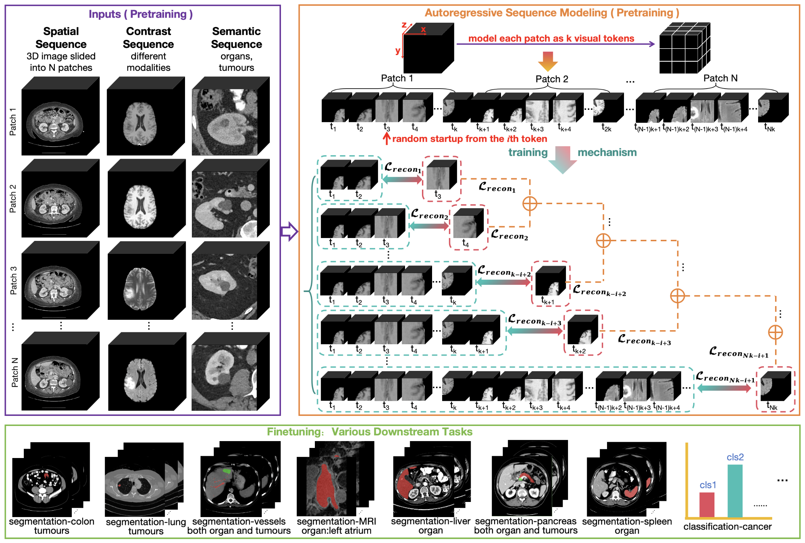

# [AAAI 2025] Autoregressive Sequence Modeling for 3D Medical Image Representation

This is an official PyTorch implementation of "[**Autoregressive Sequence Modeling for 3D Medical Image Representation**](https://arxiv.org/abs/2409.08691)".
<center> 

</center>

### Requirements
cuda==11.8<br />
python==3.8<br />
torch==2.1.2<br />
transformers==4.37.0.dev0<br />
monai==1.3.0
### Dataset
* Pre-training dataset
  * Download the [RibFrac](https://ribfrac.grand-challenge.org/dataset/), [TCIA Covid19](https://www.cancerimagingarchive.net/collection/ct-images-in-covid-19/), [AMOS22](https://amos22.grand-challenge.org/), [ISLES 2022](https://isles22.grand-challenge.org/), [AbdomenCT-1K](https://github.com/JunMa11/AbdomenCT-1K), [TotalSegmentator](https://github.com/wasserth/TotalSegmentator), [Verse 2020](https://github.com/anjany/verse), [RSNA-2022-CSFD](https://www.kaggle.com/competitions/rsna-2022-cervical-spine-fracture-detection/data), [RSNA-2020-PED](https://www.kaggle.com/competitions/rsna-str-pulmonary-embolism-detection/data), [STOIC](https://stoic2021.grand-challenge.org/stoic-db/), [FLARE22](https://flare22.grand-challenge.org/Dataset/), [FLARE23](https://codalab.lisn.upsaclay.fr/competitions/12239) for spatial sequence.
  * Download the [BraTS 23 dataset](https://www.synapse.org/Synapse:syn51156910/files/) for contrast sequence (BraTS-GLI, BraTS-MEN, BraTS-MET, BraTS-PED, BraTS-SSA).
  * Download the [DeepLesion dataset](https://nihcc.app.box.com/v/DeepLesion) for semantic sequence.
* Fine-tuning dataset
  * Download the [MSD dataset](http://medicaldecathlon.com/).
  * Download the [LA dataset](https://github.com/yulequan/UA-MT/tree/master).
  * Download the [LungNodule dataset](https://zenodo.org/records/10519652) (nodulemnist3d.npz).
  * Download the [RICORD dataset-1A](https://www.cancerimagingarchive.net/collection/midrc-ricord-1a/) and [RICORD dataset-1B](https://www.cancerimagingarchive.net/collection/midrc-ricord-1b/).
### Pre-processing
* Pre-training
  * Use `preprocess/proc_spatial_sequence.py` to extract sub-volumes of spatial sequence.
  * Use `preprocess/proc_contrast_sequence.py` to extract sub-volumes of contrast sequence.
  * Use `preprocess/proc_semantic_sequence.py` to extract sub-volumes of semantic sequence.
  * Use `preprocess/gen_pretrain_list.py` to obtain txt files of sub-volumes used in `pretrain`.
* Fine-tuning
  * LungNodule: Use `preprocess/preprocess_npz.py` to resize images.
  * COVID: Use `preprocess/dicom2nifti.py` to save nii images. Use `preprocess/preprocess_nii.py` to resize images.
### Pre-training
* Use `pretrain/run_scripts/pretrain.sh` for pre-training.
### Pre-trained Model
* Download the pre-trained [model](https://drive.google.com/file/d/1pJRaE9H4C2oc_NiMFA2XqTAE3BGtBJvp/view?usp=drive_link).
### Fine-tuning
* Segmentation: Use `downstream/segmentation/run_scripts/run_ssl.sh` for fine-tuning.
* LungNodule: Use `downstream/nodule/run_scripts/run_ssl.sh` for fine-tuning.
* COVID: Use `downstream/COVID/run_scripts/run_ssl.sh` for fine-tuning.
## Citation
If you find this project useful, please consider citing:
```
@inproceedings{wang2025autoregressive,
  title={Autoregressive sequence modeling for 3d medical image representation},
  author={Wang, Siwen and Wang, Churan and Gao, Fei and Su, Lixian and Zhang, Fandong and Wang, Yizhou and Yu, Yizhou},
  booktitle={Proceedings of the AAAI Conference on Artificial Intelligence},
  volume={39},
  number={8},
  pages={7871--7879},
  year={2025}
}
```
## Acknowledgment
Our implementation is based on the following codebases. We thank the authors for their works.
> [Llama](https://github.com/meta-llama/llama-cookbook/)   
> [MONAI](https://github.com/Project-MONAI/MONAI)     
> [MedMNIST](https://github.com/MedMNIST/experiments)   
> [MedCoSS](https://github.com/yeerwen/MedCoSS)  
## Contact
If you have any questions, please feel free to [contact me](wangsiwendut@gmail.com).
